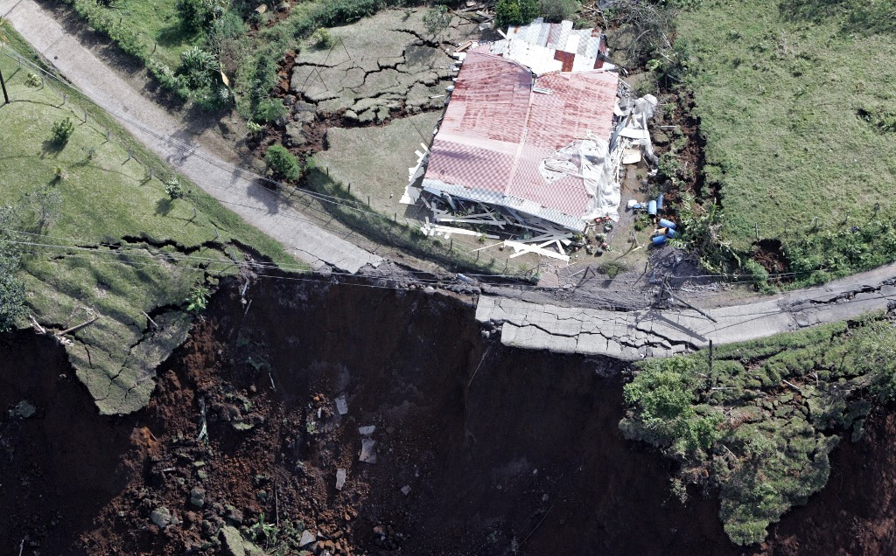

# Tarea-1
Introducción al tema sobre sismicidad en Costa Rica.

# Sismicidad en Costa Rica: patrones espaciales y riesgo sísmico

## Descripción general del tema

Costa Rica es uno de los países con **mayor actividad sísmica** del planeta. Su territorio se ubica sobre el límite de las placas tectónicas Cocos, Caribe, Nazca y el bloque de Panamá. La placa de Cocos subduce (se hunde) bajo la placa Caribe a lo largo de la costa Pacífica, en la llamada Fosa Mesoamericana, a una velocidad aproximada de 8 a 9 centímetros por año. Este proceso de subducción es el principal responsable de que en el país se localicen entre *3 000 y 4 000* sismos cada año, aunque la gran mayoría no son sentidos por la población.

Este proyecto busca **analizar la distribución espacial y temporal de los sismos en Costa Rica**, con el fin de identificar patrones geográficos de la sismicidad (zonas de mayor concentración, relación con las fallas conocidas, profundidad de los focos, etc.) y su relación con el riesgo para la población y la infraestructura. Si bien la mayoría de los sismos costarricenses son de baja magnitud, el país ha sufrido eventos históricos devastadores, como el terremoto de Cinchona en 2009 (magnitud 6.1, con 34 personas fallecidas) y el terremoto de Sámara-Nicoya en 2012 (magnitud 7.6).

## Descripción de los datos

### Fuentes de datos

Para este proyecto se utilizarán principalmente las siguientes fuentes, todas de **acceso público**:

- [Red Sismológica Nacional (RSN: UCR-ICE)](https://www.rsn.ucr.ac.cr/), operada conjuntamente por la Universidad de Costa Rica y el Instituto Costarricense de Electricidad, que publica boletines mensuales con los sismos localizados en el país.
- [Observatorio Vulcanológico y Sismológico de Costa Rica (OVSICORI-UNA)](https://www.ovsicori.una.ac.cr/), de la Universidad Nacional, que mantiene su propia red de estaciones sismológicas y reportes de sismos sentidos.
- [Catálogo sísmico del Servicio Geológico de los Estados Unidos (USGS)](https://earthquake.usgs.gov/earthquakes/search/), que permite descargar en formato CSV o GeoJSON todos los eventos sísmicos registrados globalmente, filtrando por Costa Rica y por rango de fechas.
- [Comisión Nacional de Emergencias (CNE)](https://www.cne.go.cr/), como fuente complementaria sobre impactos, declaratorias de emergencia y zonas de riesgo.

### Principales variables

De estas fuentes se obtendrán, entre otras, las siguientes variables:

1. **Ubicación geográfica** del epicentro (latitud y longitud).
2. **Magnitud** del sismo (escalas *Mw* o *Ml*, según la fuente).
3. **Profundidad** del foco sísmico, en kilómetros.
4. Fecha y hora de ocurrencia.
5. Zona geográfica o cantón más cercano al epicentro.
6. Condición de "sentido" o "no sentido" por la población.
7. Intensidad reportada (cuando esté disponible, por ejemplo mediante el módulo *¿Lo sentiste?* de la RSN).

Estos datos son *ideales* para procesarse como datos geoespaciales, ya que cada sismo constituye un punto con coordenadas que puede representarse en mapas, agruparse por zonas, o analizarse en relación con la distancia a las fallas geológicas conocidas.

## Problemas por resolver y preguntas de investigación

Con estos datos se espera responder preguntas como las siguientes:

1. ¿Cuáles son las zonas del país con mayor concentración de sismos en los últimos años?
2. ¿Existe una relación clara entre la profundidad de los sismos y su ubicación geográfica (por ejemplo, sismos más profundos hacia el interior del país, asociados a la placa subducida)?
3. ¿Cómo ha variado la cantidad de sismos mensuales y anuales a lo largo del tiempo?
4. ¿Qué proporción de los sismos localizados son efectivamente sentidos por la población, y en qué regiones se concentran los reportes de percepción?
5. ¿Qué relación existe entre las zonas de mayor sismicidad y las zonas de mayor densidad poblacional o infraestructura crítica del país?

Se prevé que respondiendo estas preguntas, se puedan construir mapas interactivos para comprender mejor las zonas en riesgo por terremotos en Costa Rica.

## Imágenes

Ejemplos de la información disponible:

!
[Mapa de intensidad sísmica del terremoto de Nicoya (2012)](Nicoya-2012.jpg)
*Mapa de intensidades (ShakeMap) del terremoto de Nicoya, Costa Rica, de magnitud 6.5, ocurrido el 24 de octubre de 2012. Fuente: [USGS Earthquake Hazards Program](https://earthquake.usgs.gov/earthquakes/eventpage/usp000jucg).*

*El terremoto de Cinchona (Mw 6.1, enero de 2009) provocó numerosos deslizamientos en la zona norte del Valle Central. Fuente: [El Observador, "17 años del Terremoto de Cinchona, el más trágico en lo que va del siglo"](https://observador.cr/terremoto-de-cinchona-17-anos-8-enero-2009/).*

## Referencias

- Linkimer, L., Fallas, C. y Arroyo, I. G. (2024). Origen de los sismos sentidos en Costa Rica durante el año 2023. *Revista Geológica de América Central*, 70. Recuperado de [https://revistas.ucr.ac.cr/index.php/geologica/article/view/58439](https://revistas.ucr.ac.cr/index.php/geologica/article/view/58439)
- Red Sismológica Nacional (RSN: UCR-ICE). Recuperado de [https://www.rsn.ucr.ac.cr/](https://www.rsn.ucr.ac.cr/)
- Observatorio Vulcanológico y Sismológico de Costa Rica (OVSICORI-UNA). Recuperado de [https://www.ovsicori.una.ac.cr/](https://www.ovsicori.una.ac.cr/)
- U.S. Geological Survey. (2012). *M 6.5 - Costa Rica*. Recuperado de [https://earthquake.usgs.gov/earthquakes/eventpage/usp000jucg](https://earthquake.usgs.gov/earthquakes/eventpage/usp000jucg)
- Wikipedia. (s. f.). *2009 Cinchona earthquake*. Recuperado de [https://en.wikipedia.org/wiki/2009_Cinchona_earthquake](https://en.wikipedia.org/wiki/2009_Cinchona_earthquake)
